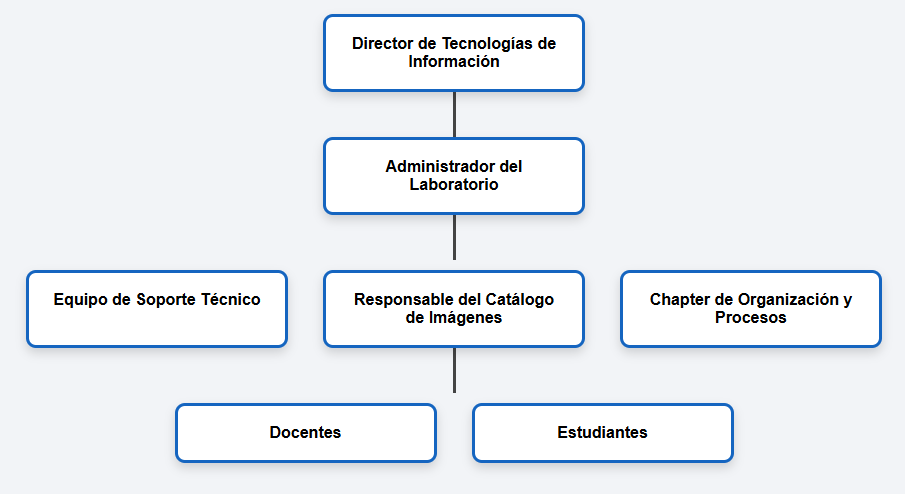

# Estructura Organizacional del Laboratorio de Computación

---

# 1. Objetivos de la Organización

La estructura organizacional propuesta busca alcanzar los siguientes objetivos:

- Definir claramente las responsabilidades de cada participante.
- Reducir la duplicidad de funciones.
- Facilitar la comunicación entre los diferentes responsables.
- Garantizar una adecuada administración de los recursos tecnológicos.
- Estandarizar los procesos operativos del laboratorio.
- Favorecer la mejora continua de los servicios brindados.

---

# 2. Principios Organizacionales

La organización del laboratorio se fundamenta en los siguientes principios:

- Claridad en la asignación de responsabilidades.
- Separación entre funciones administrativas y técnicas.
- Coordinación permanente entre docentes y administradores.
- Gestión basada en procesos.
- Trazabilidad de las actividades realizadas.
- Mejora continua mediante indicadores de desempeño.

---

# 3. Organigrama General

El siguiente organigrama representa la estructura organizacional mínima propuesta para el laboratorio.

---

# 4. Roles Organizacionales

## 4.1 Director de Tecnologías de Información

Es el responsable de establecer las políticas generales relacionadas con la infraestructura tecnológica de la institución.

### Responsabilidades

- Aprobar políticas tecnológicas.
- Autorizar inversiones.
- Supervisar el funcionamiento general del laboratorio.
- Aprobar proyectos de mejora.

---

## 4.2 Administrador del Laboratorio

Es el responsable directo de la operación del laboratorio.

### Responsabilidades

- Administrar recursos físicos.
- Coordinar el uso de los laboratorios.
- Gestionar inventarios.
- Coordinar mantenimientos.
- Supervisar al personal técnico.
- Gestionar incidencias.

---

## 4.3 Responsable del Catálogo de Imágenes

Es el encargado de administrar el repositorio oficial de imágenes utilizadas por los cursos y proyectos.

### Responsabilidades

- Validar nuevas imágenes Docker.
- Mantener actualizado el catálogo.
- Verificar vulnerabilidades.
- Aprobar nuevas versiones.
- Documentar cambios realizados.

---

## 4.4 Equipo de Soporte Técnico

Brinda soporte operativo a estudiantes y docentes.

### Responsabilidades

- Resolver incidencias.
- Instalar equipos cuando sea necesario.
- Verificar funcionamiento del hardware.
- Registrar problemas detectados.

---

## 4.5 Docentes

Representan a los responsables académicos de cada curso.

### Responsabilidades

- Solicitar imágenes de software.
- Definir necesidades tecnológicas.
- Validar recursos para los cursos.
- Supervisar el correcto uso del laboratorio.

---

## 4.6 Estudiantes

Son los usuarios finales del laboratorio.

### Responsabilidades

- Utilizar correctamente los recursos.
- Cumplir las políticas del laboratorio.
- Reportar incidencias.
- Utilizar únicamente imágenes autorizadas.

---

# 5. Chapter de Organización y Procesos

Como parte del modelo organizacional propuesto se incorpora un **Chapter de Organización y Procesos**, integrado por docentes con experiencia en gestión organizacional y mejora de procesos.

Su finalidad es asegurar que los procesos del laboratorio permanezcan documentados, estandarizados y alineados con los objetivos institucionales.

Entre sus principales responsabilidades se encuentran:

- Diseñar nuevos procesos.
- Revisar procesos existentes.
- Actualizar la documentación.
- Definir indicadores.
- Coordinar auditorías internas.
- Promover la mejora continua.

---

# 6. Relaciones entre Roles

La interacción entre los diferentes actores se desarrolla de la siguiente manera:

- El Director de Tecnologías de Información establece las políticas generales.
- El Administrador del Laboratorio coordina la operación diaria.
- El Responsable del Catálogo de Imágenes administra los entornos de desarrollo.
- Los Docentes definen los requerimientos académicos.
- El Equipo de Soporte Técnico atiende las incidencias.
- Los Estudiantes utilizan los recursos siguiendo las políticas establecidas.

Esta distribución permite mantener una adecuada separación entre responsabilidades estratégicas, tácticas y operativas.

---

# 7. Beneficios de la Estructura Organizacional

La implementación de esta estructura permite:

- Mejor distribución de responsabilidades.
- Mayor control sobre los recursos tecnológicos.
- Disminución de tiempos de respuesta.
- Mejor coordinación entre áreas.
- Mayor trazabilidad de las actividades.
- Facilita la implementación de procesos BPMN.
- Favorece la mejora continua.