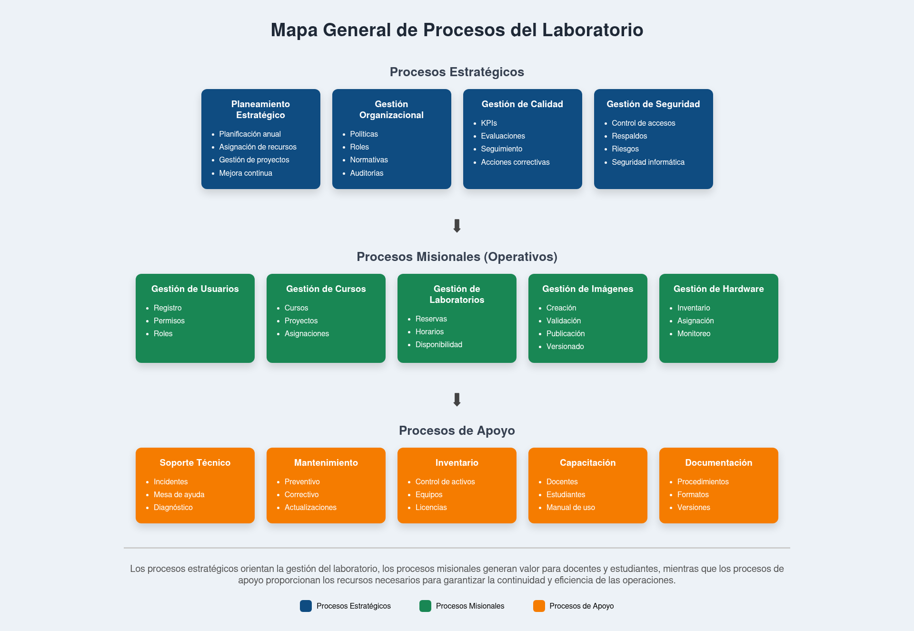

# Mapa General de Procesos del Laboratorio

---

# 1. Objetivo

El mapa de procesos tiene como propósito identificar, organizar y clasificar los procesos que forman parte de la operación del laboratorio de computación.

Su elaboración permite comprender la relación existente entre las actividades estratégicas, operativas y de apoyo, facilitando posteriormente la documentación de procesos mediante diagramas BPMN y la definición de indicadores de desempeño.

---

# 2. Clasificación de los Procesos

La organización del laboratorio se estructura en tres grandes grupos de procesos:

- Procesos Estratégicos
- Procesos Operativos (Misionales)
- Procesos de Apoyo

Esta clasificación facilita la administración del laboratorio y permite establecer claramente las responsabilidades de cada área.

---

# 3. Mapa General de Procesos

---

# 4. Procesos Estratégicos

Los procesos estratégicos son aquellos encargados de establecer la dirección del laboratorio, definir objetivos institucionales y promover la mejora continua.

Se encuentran conformados por los siguientes procesos:

## Planeamiento del Laboratorio

Define los objetivos, recursos, presupuesto y necesidades tecnológicas del laboratorio.

## Gestión Organizacional

Define la estructura organizacional, los roles, las responsabilidades y las políticas internas.

## Gestión de Calidad

Evalúa el desempeño de los procesos mediante indicadores y propone acciones de mejora continua.

## Gestión de Seguridad

Establece políticas relacionadas con el acceso, protección de la información y uso adecuado de los recursos tecnológicos.

---

# 5. Procesos Operativos

Son los procesos que generan valor para los usuarios del laboratorio.

## Gestión de Usuarios

- Registro de usuarios.
- Asignación de permisos.
- Administración de roles.

## Gestión de Cursos y Proyectos

- Creación de cursos.
- Creación de proyectos.
- Asignación de participantes.

## Gestión de Recursos de Hardware

- Inventario.
- Reserva de equipos.
- Asignación de recursos.
- Liberación de equipos.

## Gestión de Imágenes de Software

- Solicitud de imágenes.
- Validación.
- Publicación.
- Actualización.
- Descarga por los usuarios.

## Gestión de Laboratorios

- Programación de horarios.
- Asignación de laboratorios.
- Control de utilización.

---

# 6. Procesos de Apoyo

Los procesos de apoyo permiten que los procesos operativos funcionen correctamente.

## Soporte Técnico

- Atención de incidencias.
- Resolución de problemas.
- Configuración de equipos.

## Gestión del Inventario

- Registro de activos.
- Control de existencias.
- Mantenimiento de inventario.

## Mantenimiento

- Mantenimiento preventivo.
- Mantenimiento correctivo.
- Actualización de equipos.

## Capacitación

- Capacitación de docentes.
- Capacitación de estudiantes.
- Elaboración de manuales.

## Administración Documental

- Gestión de documentos.
- Actualización de procedimientos.
- Control de versiones.

---

# 7. Relación entre los Procesos

Los procesos estratégicos establecen la planificación y dirección del laboratorio.

Los procesos operativos ejecutan las actividades necesarias para brindar los servicios del laboratorio a estudiantes y docentes.

Los procesos de apoyo suministran los recursos técnicos y administrativos que permiten el correcto funcionamiento de los procesos operativos.

Esta interacción garantiza una gestión integral del laboratorio y facilita la mejora continua de todos sus procesos.

---

# 8. Beneficios del Mapa de Procesos

La elaboración del mapa de procesos proporciona los siguientes beneficios:

- Permite visualizar la organización desde una perspectiva basada en procesos.
- Facilita la identificación de responsabilidades.
- Sirve como punto de partida para la elaboración de diagramas BPMN.
- Mejora la coordinación entre las diferentes áreas del laboratorio.
- Favorece la implementación de indicadores de desempeño.
- Contribuye a la mejora continua de la organización.