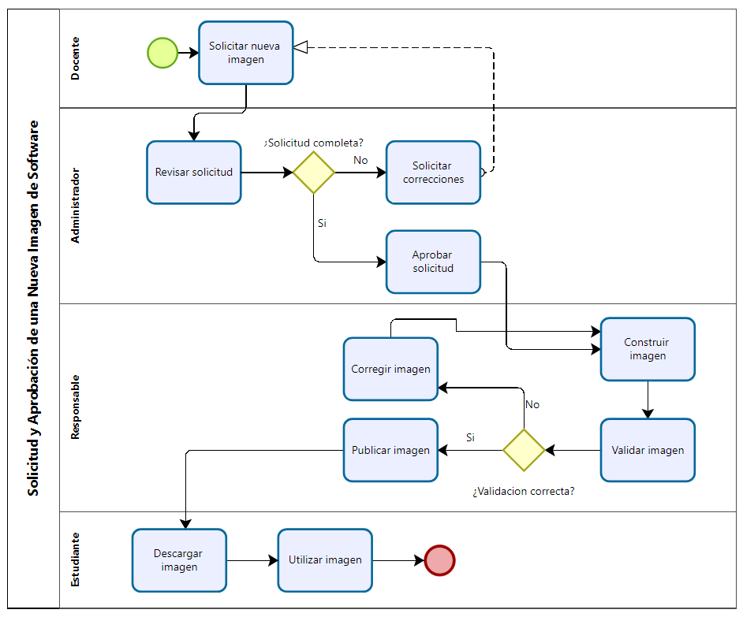

# Proceso BPMN: Solicitud y Aprobación de una Nueva Imagen de Software

---

# 1. Objetivo

Establecer el procedimiento para solicitar, evaluar, aprobar y publicar una nueva imagen de software que será utilizada en los laboratorios de computación.

Este proceso garantiza que todas las imágenes disponibles cumplan con los requisitos académicos, técnicos y de seguridad definidos por la institución.

---

# 2. Participantes

En este proceso intervienen los siguientes actores:

- Docente
- Administrador del Laboratorio
- Responsable del Catálogo de Imágenes
- Estudiantes

---

# 3. Descripción del Proceso

El proceso inicia cuando un docente identifica la necesidad de utilizar un nuevo entorno de desarrollo o software para un curso.

Posteriormente, el docente registra una solicitud dirigida al Administrador del Laboratorio, indicando las herramientas requeridas y la justificación académica.

El Administrador revisa la solicitud para verificar que la información esté completa. En caso de existir observaciones, la solicitud es devuelta al docente para su corrección.

Si la solicitud es aprobada, el Responsable del Catálogo de Imágenes procede a construir o actualizar la imagen correspondiente.

Una vez finalizada la construcción, se realizan pruebas funcionales y de seguridad para comprobar que la imagen puede utilizarse en el laboratorio.

Si la validación resulta satisfactoria, la imagen es publicada en el catálogo institucional y queda disponible para que los estudiantes la descarguen y utilicen durante el desarrollo de sus actividades académicas.

Finalmente, el proceso concluye notificando al docente que la nueva imagen se encuentra disponible.

---

# 4. Diagrama BPMN

---

# 5. Entradas

- Solicitud del docente.
- Requerimientos de software.
- Políticas institucionales.

---

# 6. Salidas

- Imagen publicada.
- Catálogo actualizado.
- Docente notificado.

---

# 7. Indicadores

- Tiempo promedio de aprobación.
- Tiempo de creación de la imagen.
- Número de solicitudes aprobadas.
- Número de solicitudes rechazadas.
- Tiempo de publicación.

---

# 8. Reglas del Proceso

- Toda solicitud debe estar debidamente justificada.
- Solo podrán publicarse imágenes previamente validadas.
- Toda nueva versión deberá registrarse en el catálogo institucional.
- Las imágenes deberán cumplir las políticas de seguridad definidas por la institución.